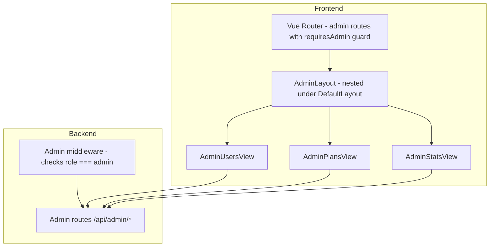

# Admin Panel Implementation Plan

> **Status:** Ready for implementation
> **Scope:** Full admin panel for managing users, plans/pricing, and platform stats
> **Route prefix:** `/admin` with nested sub-routes

---

## Design Decisions (Approved)

| Decision | Choice |
|----------|--------|
| Admin identification | `role` column (`user`/`admin`) in `users` table; first user (`userId === 1`) is auto-assigned `admin` |
| Plans storage | DB table (`plans`) — fully editable by admin |
| Page structure | Nested routes: `/admin/users`, `/admin/plans`, `/admin/stats` |
| User deletion | Both options: cascade delete (user + all data) and user-only delete (keep records) |

---

## Architecture Overview



---

## Phase 1: Database & Auth Foundation

### 1.1 Migration: Add `role` to users table

- New migration file: `api/migrations/20260613000001-add-role-to-users.js`
- Add `role` column: `STRING(20)`, default `'user'`, validate `isIn: [['user', 'admin']]`
- Set first user as admin: `UPDATE users SET role = 'admin' WHERE id = 1`
- Add index on `role` column for fast admin checks

### 1.2 Migration: Create `plans` table

- New migration file: `api/migrations/20260613000002-create-plans.js`
- Columns:
  - `tier` STRING PK — matches user tier values (`free`, `premium`, `enterprise`)
  - `name` STRING — display name
  - `price_monthly` FLOAT
  - `price_yearly` FLOAT
  - `domains` INTEGER — domain limit (-1 = unlimited)
  - `rdap_daily` INTEGER — daily RDAP calls
  - `ai_daily` INTEGER — daily AI calls
  - `watchlist` INTEGER — watchlist items limit
  - `wishlist` INTEGER — wishlist items limit
  - `features` TEXT (JSON) — flexible feature flags/labels
  - `active` BOOLEAN — is this plan available
  - `created_at`, `updated_at` DATE
- Seed default rows (free, premium, enterprise) matching current [`TIER_LIMITS`](api/auth.ts:37)

### 1.3 Update User model

- [`api/models/User.ts`](api/models/User.ts:3) — add `role: 'user' | 'admin'` field
- Update validation: `isIn: [['user', 'admin']]`

### 1.4 Create Plan model

- New file: `api/models/Plan.ts`
- Fields match migration schema
- Static helper: `Plan.getLimits(tier)` to replace hardcoded [`TIER_LIMITS`](api/auth.ts:37)

### 1.5 Update auth flows

- [`api/auth.ts`](api/auth.ts:23) — `signJwt()` now includes `role` claim
- [`api/auth.ts`](api/auth.ts:28) — `verifyJwt()` returns `{ userId, email, tier, role }`
- [`api/app.ts`](api/app.ts:121) — auth middleware sets `c.set('role', payload.role)`
- [`api/app.ts`](api/app.ts:172) — Register endpoint: check if this is the first user, assign `admin` role

---

## Phase 2: Backend — Admin API

### 2.1 Admin middleware

- In [`api/app.ts`](api/app.ts), create reusable `adminGuard` middleware:
  ```
  app.use('/api/admin/*', async (c, next) => {
    if (c.get('role') !== 'admin') {
      return c.json({ error: 'Admin access required' }, 403)
    }
    return next()
  })
  ```

### 2.2 Admin routes (all under `/api/admin`)

| Route | Method | Description |
|-------|--------|-------------|
| `/api/admin/stats` | GET | Platform stats: total users, domains, revenue, tier distribution |
| `/api/admin/users` | GET | List all users (paginated, searchable) |
| `/api/admin/users/:id` | GET | Get user details with stats |
| `/api/admin/users/:id` | PATCH | Update user (tier, role, email) |
| `/api/admin/users/:id` | DELETE (query: `cascade=true/false`) | Delete user, optionally cascade |
| `/api/admin/users/:id/reset-usage` | POST | Reset daily_ai_calls, daily_rdap_calls |
| `/api/admin/plans` | GET | List all plans |
| `/api/admin/plans/:tier` | PUT | Update plan limits/pricing/features |
| `/api/admin/domains` | GET | List all domains (paginated, filterable by user) |
| `/api/admin/health` | GET | System health: DB status, disk usage, etc. |

### 2.3 Cascade delete logic

- `cascade=true`: Delete user → delete their domains → delete domain tags, ledger entries, prospects, watchlist items, wishlist items, notifications
- `cascade=false` (delete user only): Delete user record only, leave orphaned data (admin can review later)

### 2.4 Stats endpoint

Aggregate queries for admin dashboard:
- Total users by tier
- Total domains by status
- Total ledger entries / revenue
- Recent registrations (last 7/30 days)
- Active vs inactive users

---

## Phase 3: Frontend — Admin Store & API Client

### 3.1 Admin Pinia store

- New file: `src/stores/admin.ts`
- State: `users`, `plans`, `stats`, `loading`, `error`
- Actions:
  - `fetchUsers()`, `fetchUser(id)`, `updateUser(id, data)`, `deleteUser(id, cascade)`, `resetUsage(id)`
  - `fetchPlans()`, `updatePlan(tier, data)`
  - `fetchStats()`, `fetchDomains()`
- Getters: computed stats from state

### 3.2 API client additions

- [`src/lib/api.ts`](src/lib/api.ts) — add admin API methods or let store call `api.get/post/patch/delete` directly with `/api/admin/...` paths

---

## Phase 4: Frontend — Admin Layout & Router

### 4.1 Admin layout

- New file: `src/layouts/AdminLayout.vue`
- Extends or wraps `DefaultLayout`
- Adds admin sub-navigation (tabs/sidebar) for Users | Plans | Stats | Domains
- Shows "Admin Panel" header with role badge

### 4.2 Router additions

- [`src/router/index.ts`](src/router/index.ts) — add nested admin routes:
  ```
  {
    path: '/admin',
    component: AdminLayout,
    meta: { requiresAuth: true, requiresAdmin: true },
    children: [
      { path: '', redirect: '/admin/users' },
      { path: 'users', name: 'admin-users', component: AdminUsersView },
      { path: 'users/:id', name: 'admin-user-detail', component: AdminUserDetailView },
      { path: 'plans', name: 'admin-plans', component: AdminPlansView },
      { path: 'stats', name: 'admin-stats', component: AdminStatsView },
      { path: 'domains', name: 'admin-domains', component: AdminDomainsView },
    ],
  }
  ```

### 4.3 Route guard update

- Extend [`beforeEach`](src/router/index.ts:81) to check `requiresAdmin` meta:
  - Fetch user profile if not loaded
  - Check `auth.user.role === 'admin'`
  - Redirect to `/home` if not admin

### 4.4 Sidebar update

- [`src/components/Sidebar.vue`](src/components/Sidebar.vue:19) — add Admin menu item:
  - Conditionally rendered: `v-if="auth.user?.role === 'admin'"`
  - Uses `bi-shield-lock` icon
  - Links to `/admin`

---

## Phase 5: Frontend — Admin Views

### 5.1 AdminUsersView

- User table with columns: ID, Email, Tier, Role, Domains count, Created, Actions
- Search by email
- Filter by tier, role
- Inline edit for tier/role via dropdown
- Action buttons: Edit, Reset Usage, Delete (with modal asking cascade or user-only)
- Pagination

### 5.2 AdminUserDetailView

- Full user profile card
- User's domains list
- User's ledger entries
- Usage stats (AI calls, RDAP calls)
- Edit form for all user fields
- Delete with cascade option

### 5.3 AdminPlansView

- Plan cards (Free, Premium, Enterprise) with current limits displayed
- Click to edit: modal or inline editing
- Fields: price_monthly, price_yearly, domains, rdap_daily, ai_daily, watchlist, wishlist, features JSON, active toggle
- Save changes to DB
- Plans update takes effect for new tier assignments (existing users keep their current limits until next login)

### 5.4 AdminStatsView

- Summary cards: Total Users, Total Domains, Total Revenue, Active Users
- Tier distribution chart (simple bar chart or stat cards)
- Recent registrations list
- Platform health indicators

### 5.5 AdminDomainsView

- All domains across all users
- Filter by user, TLD, status
- Domain count per user summary

---

## Phase 6: Integration & Polish

### 6.1 Update TIER_LIMITS usage

- Replace all references to hardcoded `TIER_LIMITS` in [`api/app.ts`](api/app.ts) with `Plan.getLimits(tier)` that reads from DB
- Cache plan limits in memory with TTL to avoid DB hits on every request

### 6.2 Update auth store

- [`src/stores/auth.ts`](src/stores/auth.ts) — add `role` to user state, expose `isAdmin` computed

### 6.3 Update SettingsView

- Show current plan details from DB
- Display plan limits dynamically

### 6.4 Tests

- Unit tests for admin store
- API tests for admin routes (auth guard, CRUD, cascade delete)
- Component tests for admin views

---

## File Changes Summary

| Action | File |
|--------|------|
| **Create** | `api/migrations/20260613000001-add-role-to-users.js` |
| **Create** | `api/migrations/20260613000002-create-plans.js` |
| **Create** | `api/models/Plan.ts` |
| **Create** | `src/stores/admin.ts` |
| **Create** | `src/layouts/AdminLayout.vue` |
| **Create** | `src/views/admin/AdminUsersView.vue` |
| **Create** | `src/views/admin/AdminUserDetailView.vue` |
| **Create** | `src/views/admin/AdminPlansView.vue` |
| **Create** | `src/views/admin/AdminStatsView.vue` |
| **Create** | `src/views/admin/AdminDomainsView.vue` |
| **Create** | `tests/api/admin-routes.spec.ts` |
| **Create** | `tests/unit/admin-store.spec.ts` |
| **Modify** | `api/models/User.ts` — add `role` field |
| **Modify** | `api/models/index.ts` — register Plan model |
| **Modify** | `api/auth.ts` — add `role` to JWT |
| **Modify** | `api/app.ts` — admin middleware, admin routes, plan-based limits |
| **Modify** | `src/router/index.ts` — admin routes + guard |
| **Modify** | `src/stores/auth.ts` — expose `isAdmin` |
| **Modify** | `src/components/Sidebar.vue` — admin menu item |
| **Modify** | `src/types/index.ts` — add admin types |

---

## Implementation Order

1. Database migrations + models (Phase 1)
2. Auth layer updates — JWT, middleware (Phase 1.5)
3. Backend admin API routes (Phase 2)
4. Frontend admin store (Phase 3)
5. Router + layout + guard (Phase 4)
6. Admin views — Users, Plans, Stats, Domains (Phase 5)
7. Integration — replace hardcoded limits, polish (Phase 6)
8. Tests (Phase 6)
