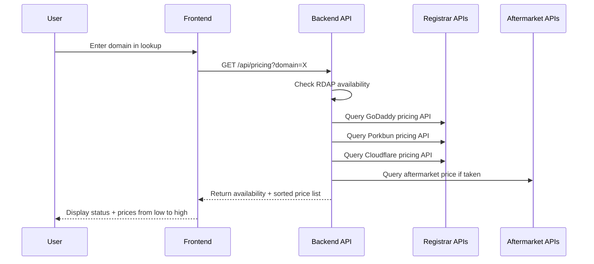

# Domain Pricing Feature — Implementation Plan

## Overview

Add a domain pricing feature that shows users:
1. **Registration prices** for available domains across multiple registrars
2. **Aftermarket/purchase prices** for taken domains from aftermarket aggregators
3. **Clear transparency** — always show whether a domain is taken or available, never hide this information

Results are sorted lowest-to-highest so users can choose the cheapest provider.

## Approach: TDD (Test-Driven Development)

Every feature is built test-first:
1. Write failing test
2. Implement feature
3. Confirm test passes
4. Refactor if needed

---

## Architecture

### Two-Tier Approach

| Tier | Data Source | When | Cost | Effort |
|------|------------|------|------|--------|
| **Tier 1 — Free (server-side)** | Public APIs with env-configured keys (GoDaddy, Porkbun, Cloudflare) | On-demand lookup | Free (APIs are free) | Low |
| **Tier 2 — Premium (future)** | Paid bulk APIs (NameBio, Estibot, GoDaddy aftermarket) | On-demand lookup | Per-call cost | Medium |

### Data Flow



---

## Supported Registrar APIs (Free, No API Key Required for Pricing)

| Registrar | API Endpoint | Auth | Registration Price | Notes |
|-----------|-------------|------|-------------------|-------|
| **Cloudflare** | `GET /client/v4/accounts/{account_id}/registrar/domains/{domain}/purchase` | Bearer token | At-cost pricing | Free API key from Cloudflare dashboard |
| **Porkbun** | `POST https://api.porkbun.com/api/json/v3/pricing/get` | API key + secret | Full TLD pricing list | Free with any account; returns pricing for all TLDs |
| **GoDaddy** | `GET /v1/domains/available?domain=X` + `GET /v1/domains/tlds` | API key + secret | Per-domain check | Already partially integrated (env vars exist) |
| **Dynadot** | `GET https://api.dynadot.com/api1/domain/pricing` | API key | Full pricing catalog | Free with account |
| **NameSilo** | `POST https://www.namesilo.com/api/domainPrice` | API key | Per-domain pricing | Free with account |

### Recommended Minimum Viable Set

Start with **Porkbun**, **Cloudflare**, and **GoDaddy** because:
- All three are free with no minimum account balance
- Porkbun and Cloudflare expose TLD pricing catalogs (one API call gives all TLD prices)
- GoDaddy env vars already exist
- Cloudflare offers at-cost pricing (cheapest for .com)

---

## Feature Design

### 1. Registration Pricing — Available Domains

When a domain is **available**, show a price comparison table:

```
Domain: example.com — Available

| Provider   | Registration | Renewal | Total Year 1 |
|------------|-------------|---------|--------------|
| Cloudflare | $10.11      | $10.11  | $10.11       |
| Porkbun    | $9.58       | $9.58   | $9.58        |
| GoDaddy    | $11.99      | $21.99  | $11.99       |
```

### 2. Aftermarket Pricing — Taken Domains

When a domain is **taken**, show estimated aftermarket value from:
- Existing appraisal engine (Tier 1 — already built, zero cost)
- Comparable sales data (Tier 2 — requires NameBio or similar API)

For Tier 1, we enhance the existing `appraise()` function to include a "fair market price" estimate.

### 3. Unified Pricing Card

A single component that adapts based on availability:

```
+---------------------------------------------------+
| example.com                          [Available]   |
|                                                     |
| Best Price: $9.58/yr (Porkbun)                     |
|                                                     |
| +----------+------------+-------------+             |
| | Provider | Register   | Renewal     |             |
| +----------+------------+-------------+             |
| | Porkbun  | $9.58      | $9.58       |  <- Best   |
| |Cloudflare| $10.11     | $10.11      |             |
| | GoDaddy  | $11.99     | $21.99      |             |
| +----------+------------+-------------+             |
|                                                     |
| [Register at Porkbun ->]                           |
+---------------------------------------------------+
```

### 4. Transparency — Always Show Domain Status

Every pricing display must clearly indicate:
- **"Available for registration"** (green badge) + registration prices from providers
- **"Already taken / Registered"** (red/gray badge) + registrar info + aftermarket estimate
- **"Unknown status"** (yellow badge) + what we could determine

Never hide the availability status from the user. The pricing section is additive to the existing RDAP/WHOIS data, not a replacement.

---

## Implementation Steps

### Phase 1 — Backend: Pricing API

#### Step 1.1: Write tests for pricing providers

File: `tests/api/pricing-providers.spec.ts`

Test each adapter with mocked HTTP responses:
- Porkbun: test TLD pricing fetch, caching, error handling
- Cloudflare: test pricing fetch, auth, error handling
- GoDaddy: test availability + pricing, error handling

#### Step 1.2: Create Pricing Provider Interface + Cache

File: `api/pricing/providers.ts`

```ts
interface PricingProvider {
  name: string
  getRegistrationPrice(domain: string, tld: string): Promise<PricingResult | null>
  getTldPricing(tld: string): Promise<TldPricing | null>
}

interface PricingResult {
  provider: string
  registerPrice: number | null
  renewPrice: number | null
  transferPrice: number | null
  currency: string
}
```

File: `api/pricing/cache.ts` — In-memory cache with 24h TTL for TLD pricing catalogs.

#### Step 1.3: Implement Provider Adapters

- `api/pricing/porkbun.ts` — Porkbun pricing API
- `api/pricing/cloudflare.ts` — Cloudflare Registrar pricing
- `api/pricing/godaddy.ts` — GoDaddy pricing

Each provider:
- Fetches TLD pricing catalog on first call (cached for 24h)
- Returns per-domain registration + renewal prices
- Gracefully handles API errors (returns null, never throws)

#### Step 1.4: Write tests for pricing route

File: `tests/api/pricing-routes.spec.ts`

- Test available domain returns registration prices
- Test taken domain returns availability info + no registration prices
- Test graceful fallback when all providers fail
- Test caching behavior (second call returns cached)
- Test rate limiting

#### Step 1.5: Add Pricing API Route

File: `api/app.ts`

```
GET /api/pricing?domain=example.com
```

Response:
```json
{
  "domain": "example.com",
  "available": true,
  "prices": [
    { "provider": "Porkbun", "register": 9.58, "renew": 9.58, "currency": "USD" },
    { "provider": "Cloudflare", "register": 10.11, "renew": 10.11, "currency": "USD" },
    { "provider": "GoDaddy", "register": 11.99, "renew": 21.99, "currency": "USD" }
  ]
}
```

#### Step 1.6: Update Environment Variables

Add to `.env.sample`:
```
# Domain Pricing Providers (all optional)
PORKBUN_API_KEY=
PORKBUN_SECRET_KEY=
CLOUDFLARE_API_KEY=
```

GoDaddy vars already exist (`GODADDY_API_KEY`, `GODADDY_SECRET_KEY`).

All three providers are already configured in `.env` — no additional setup needed.

---

### Phase 2 — Frontend: Pricing Components

#### Step 2.1: Add Pricing Types

File: `src/types/index.ts`

```ts
export interface DomainPricing {
  provider: string
  register: number | null
  renew: number | null
  transfer: number | null
  currency: string
  buyUrl?: string
}

export interface PricingResponse {
  domain: string
  available: boolean | null
  prices: DomainPricing[]
}
```

#### Step 2.2: Write tests for pricing store

File: `tests/unit/pricing-store.spec.ts`

- Test fetchPricing, loading, error states
- Test cache behavior
- Test reset

#### Step 2.3: Create Pricing Store

File: `src/stores/pricing.ts`

- Action: `fetchPricing(domain)` — calls `GET /api/pricing`
- State: `pricingResult`, `loading`, `error`

#### Step 2.4: Write tests for PricingCard component

File: `tests/unit/pricing-card.spec.ts`

- Test price sorting (lowest first)
- Test available vs taken domain display
- Test provider logo/name rendering
- Test "Register" link generation

#### Step 2.5: Create PricingCard Component

File: `src/components/PricingCard.vue`

- Shows sorted price table
- Highlights best price
- Shows provider logos
- "Register" button links to provider
- Clearly shows availability status

#### Step 2.6: Integrate into DomainLookupPanel

Add pricing section to `src/components/DomainLookupPanel.vue` after the appraisal section. Always show availability status prominently.

---

### Phase 3 — Integration with Existing Features

#### Step 3.1: Wishlist Pricing

Add pricing column to `src/views/WishlistView.vue` — show cheapest registration price alongside existing budget/appraisal comparison.

#### Step 3.2: Watchlist Pricing

Add pricing awareness to Watchlist — when checking availability, also fetch pricing.

#### Step 3.3: Settings Page

Add "Domain Pricing Providers" card to `src/views/SettingsView.vue` — show which providers are configured and their status.

---

## Environment Variable Setup

All three provider keys are already configured in `.env`:

| Provider | Env Var | Status |
|----------|---------|--------|
| **Porkbun** | `PORKBUN_API_KEY` + `PORKBUN_SECRET_KEY` | Configured |
| **Cloudflare** | `CLOUDFLARE_API_KEY` | Configured |
| **GoDaddy** | `GODADDY_API_KEY` + `GODADDY_SECRET_KEY` | Configured |

No additional setup needed by the user. Feature works immediately.

---

## API Rate Limits

| Provider | Rate Limit | Pricing Call Cost |
|----------|-----------|-------------------|
| Porkbun | 1 req/sec | Free |
| Cloudflare | 1200 req/5min | Free |
| GoDaddy | 60 req/sec | Free |

Since TLD pricing catalogs are cached server-side for 24h, actual API calls are minimal.

---

## File Structure

```
api/
  pricing/
    index.ts          — Main pricing aggregator
    providers.ts      — Provider interface + types
    porkbun.ts        — Porkbun adapter
    cloudflare.ts     — Cloudflare adapter
    godaddy.ts        — GoDaddy adapter
    cache.ts          — TLD pricing cache

src/
  types/
    index.ts          — Add DomainPricing types
  stores/
    pricing.ts        — Pricing store (Pinia)
  components/
    PricingCard.vue   — Price comparison table
  views/
    WishlistView.vue  — Add pricing column
  views/
    SettingsView.vue  — Add provider config card

tests/
  api/
    pricing-providers.spec.ts  — Provider adapter tests
    pricing-routes.spec.ts     — API route tests
  unit/
    pricing-card.spec.ts       — PricingCard component tests
    pricing-store.spec.ts      — Pricing store tests
```

---

## Testing Strategy (TDD)

Tests are written FIRST for each component:

### Backend Tests
- `tests/api/pricing-providers.spec.ts` — Unit tests for each adapter (mock HTTP responses)
- `tests/api/pricing-routes.spec.ts` — Integration tests for `/api/pricing`

### Frontend Tests
- `tests/unit/pricing-card.spec.ts` — Unit test for PricingCard component
- `tests/unit/pricing-store.spec.ts` — Unit test for pricing store

### Regression Tests
- Run existing test suite to ensure no regressions
- `pnpm test` must pass before any merge

---

## Future Enhancements (Phase 2+)

- **Aftermarket pricing**: Integrate NameBio API for comparable sales data
- **Price alerts**: Notify when a wishlisted domain drops below a target price
- **Bulk pricing check**: Price multiple domains at once
- **Historical pricing**: Track registration price changes over time
- **Transfer pricing**: Show transfer-in costs for users switching registrars
